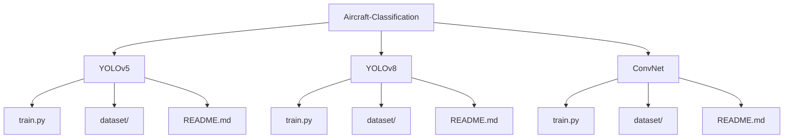

# Aircraft Classification from Aerial Imagery

## Abstract

This project addresses the challenge of identifying military aircraft from aerial images using computer vision (CV) techniques. For this project, we created a dataset of labeled aircraft using RoboFlow to demonstrate the capabilities of our models to learn and recognize different vehicles. We then applied data augmentation techniques to increase the effectiveness of our dataset and models.

The study explores the performance of three different CV models—YOLOv5, YOLOv8, and a custom deep learning implementation (ConvNet) built using PyTorch. YOLOv5 and YOLOv8, designed and documented by Ultralytics, were implemented as baseline models for comparison. Our custom model was designed to address shortcomings observed in the baseline models, focusing on balancing computational efficiency and detection accuracy. By evaluating these models, we identified performance trade-offs and gained valuable insights into optimizing CV models for accurate aircraft detection in realistic datasets.

---

## GitHub Repository Structure

This repository is structured to include submodules for the three model implementations:

---

## Model Descriptions and Differences

### **YOLOv5**

- **Purpose**: Acts as a baseline model for performance benchmarking.
- **Features**: Lightweight architecture designed for real-time object detection.
- **Performance**: Strong generalization and high-speed inference but less robust in confidence calibration compared to YOLOv8 and ConvNet.

### **YOLOv8**

- **Purpose**: An improved version of YOLOv5, offering enhanced accuracy and robustness.
- **Features**: Incorporates architectural advancements for better class consistency and precision-recall trade-offs.
- **Performance**: Achieved higher mAP@0.5 than YOLOv5 and demonstrated superior confidence calibration.

### **Custom ConvNet**

- **Purpose**: Designed to address the specific challenges of the dataset and task.
- **Features**: Compact architecture with three convolutional and three fully connected layers, balancing computational efficiency with accuracy.
- **Performance**: Exhibited the highest robustness and stability across metrics, especially in high-confidence scenarios. Slightly slower training compared to YOLO models but excelled in precision and generalization.

---

## Evaluation Metrics

- **Confusion Matricies**
- **Precision-Confidence Curves**
- **Recall-Confidence Curves**
- **Precision-Recall Curves**
- **F1-Confidence Curves**
- **Epoch Accuracy and Loss Curves** (ConvNet Implementation Only)

---

## Getting Started

### **Prerequisites**

- Python 3.8 or higher
- Required Python packages: Listed in `requirements.txt` within each model submodule
- CUDA-enabled GPU (recommended)

### **Setup**

1. Go into sub repository
2. View instructions in README.md

---

## Authors

**Alexander Green** &nbsp;&nbsp;&nbsp;&nbsp;&nbsp; Master of Science in Computer Engineering (MSCpE) 
Dept. of Electrical and Computer Engineering, University of Central Florida 
[GitHub Home](https://github.com/alexneilgreen)

**Joshua Glaspey** &nbsp;&nbsp;&nbsp;&nbsp;&nbsp;&nbsp;&nbsp; Master of Science in Computer Engineering (MSCpE) 
Dept. of Electrical and Computer Engineering, University of Central Florida 
[GitHub Home](https://github.com/jkglaspey)
